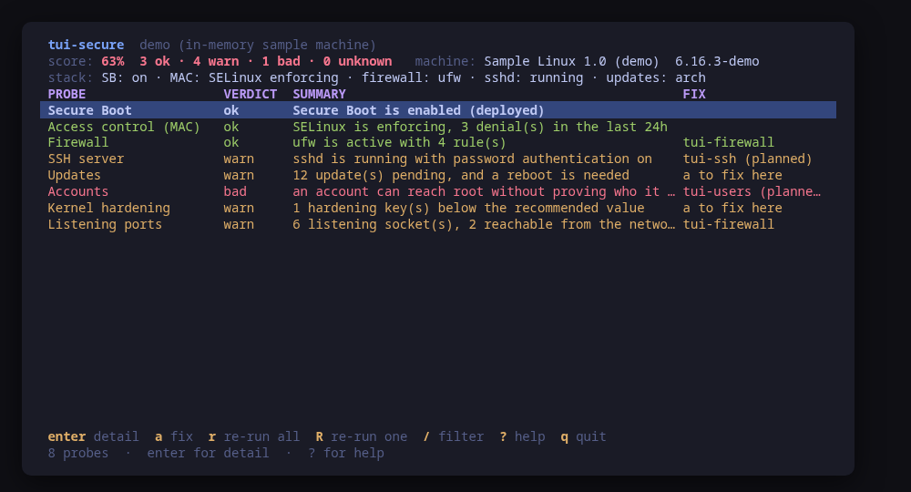
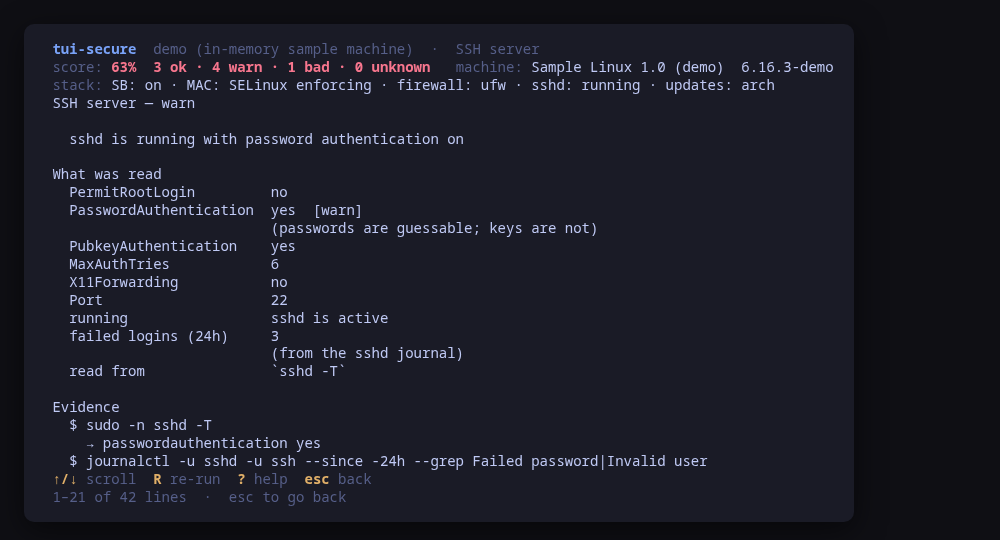
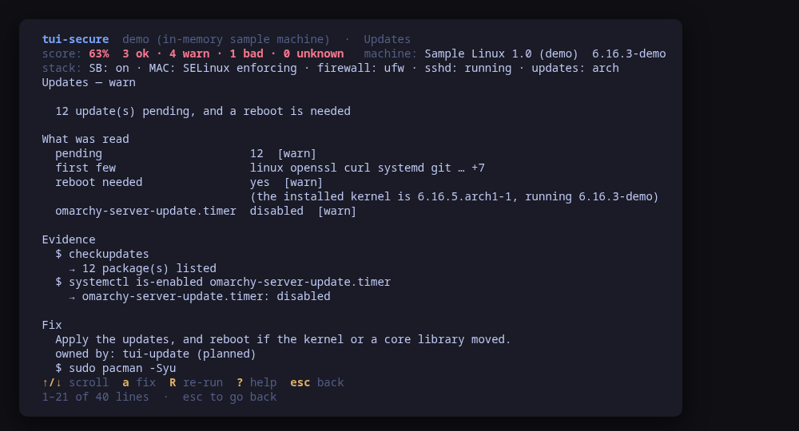
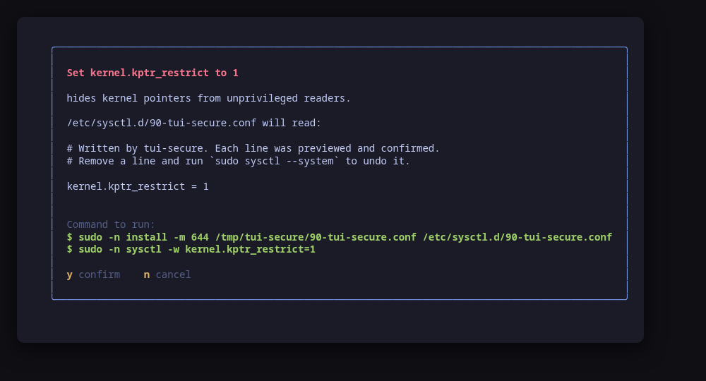
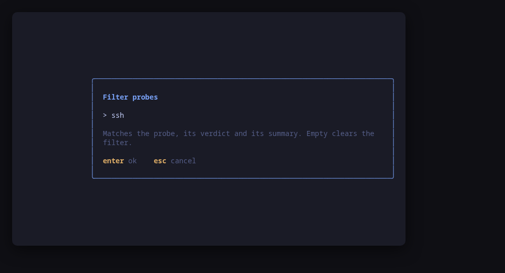
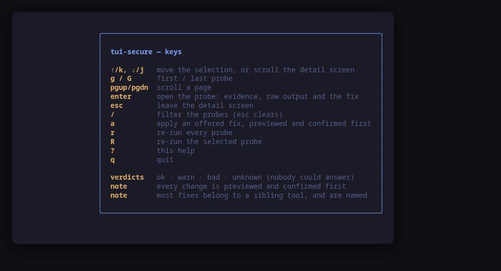

[](https://scorecard.dev/viewer/?uri=github.com/tui-tools/tui-secure)

> **Beta.** Beta: the family is days old and still changing. Package names,
> flags and keys may move without notice until 1.0. Pin versions, and report
> what breaks.

One screen for the security posture of one Linux machine. Eight probes — Secure
Boot, the MAC layer, the firewall, sshd, pending updates, accounts, kernel
hardening and listening ports — each answered `ok`, `warn`, `bad` or `unknown`,
**with the exact command behind every verdict**.

Checking any of this by hand means `bootctl`, `getenforce`, `ufw`, `sshd -T`,
`checkupdates`, `sysctl` and `ss`, in seven terminals, remembering what a good
answer looks like for each. `tui-secure` puts them on one screen, in the
[Omarchy](https://omarchy.org) visual style, and shows its working.



> **Status: early, under validation.** An independent tool that follows the
> Omarchy visual style; it is **not** part of the Omarchy project and not
> endorsed by its maintainers. Expect rough edges.

## Install

<!-- install:start -->
<!-- Generated by tui-kit/tools/render-install.py from tool.json. -->
<!-- Edit the manifest, then run `make readme`. -->

### Arch Linux

Needs the tui-tools repository, which is a [one-time
setup](https://tui-tools.github.io/install/).

The one-liner detects the distribution and adds the repository and its signing
key:

```sh
curl -fsSL https://pkgs.tui.tools/install.sh | sh
```

Piping a script into a shell is not this family's style, so here is the same
setup by hand — read it, or read the script first with `curl -fsSL
https://pkgs.tui.tools/install.sh -o install.sh`:

```sh
curl -fsSL -o /tmp/tui-tools.asc https://pkgs.tui.tools/pubkey.asc
sudo pacman-key --add /tmp/tui-tools.asc
sudo pacman-key --lsign-key \
  "$(gpg --show-keys --with-colons /tmp/tui-tools.asc | awk -F: '/^fpr:/{print $10; exit}')"
printf '[tui-tools]\nServer = https://pkgs.tui.tools/arch/$arch\n' \
  | sudo tee -a /etc/pacman.conf
sudo pacman -Sy
```

Then, and for every other tool in the family:

```sh
sudo pacman -S tui-secure
```

Upgrades then arrive with the rest of your system updates.

### Debian and Ubuntu

Needs the tui-tools repository, which is a [one-time
setup](https://tui-tools.github.io/install/).

The one-liner detects the distribution and adds the repository and its signing
key:

```sh
curl -fsSL https://pkgs.tui.tools/install.sh | sh
```

Piping a script into a shell is not this family's style, so here is the same
setup by hand — read it, or read the script first with `curl -fsSL
https://pkgs.tui.tools/install.sh -o install.sh`:

```sh
sudo install -d -m 0755 /etc/apt/keyrings
curl -fsSL https://pkgs.tui.tools/pubkey.asc \
  | sudo gpg --dearmor -o /etc/apt/keyrings/tui-tools.gpg
echo "deb [signed-by=/etc/apt/keyrings/tui-tools.gpg] https://pkgs.tui.tools/deb stable main" \
  | sudo tee /etc/apt/sources.list.d/tui-tools.list
sudo apt update
```

Then, and for every other tool in the family:

```sh
sudo apt install tui-secure
```

Upgrades then arrive with the rest of your system updates.

### Fedora and RHEL

Needs the tui-tools repository, which is a [one-time
setup](https://tui-tools.github.io/install/).

The one-liner detects the distribution and adds the repository and its signing
key:

```sh
curl -fsSL https://pkgs.tui.tools/install.sh | sh
```

Piping a script into a shell is not this family's style, so here is the same
setup by hand — read it, or read the script first with `curl -fsSL
https://pkgs.tui.tools/install.sh -o install.sh`:

```sh
sudo rpm --import https://pkgs.tui.tools/pubkey.asc
sudo curl -fsSL -o /etc/yum.repos.d/tui-tools.repo https://pkgs.tui.tools/rpm/tui-tools.repo
sudo dnf makecache
```

Then, and for every other tool in the family:

```sh
sudo dnf install tui-secure
```

Upgrades then arrive with the rest of your system updates.

### Any distribution, static binary

```sh
curl -fsSL https://github.com/tui-tools/tui-secure/releases/download/v0.1.2/tui-secure_0.1.2_linux_amd64.tar.gz | tar -xz tui-secure
sudo install -m0755 tui-secure /usr/local/bin/tui-secure
```

One static binary. Verify it against checksums.txt from the same release.

### From source

```sh
git clone https://github.com/tui-tools/tui-secure
cd tui-secure && make build
sudo install -m0755 bin/tui-secure /usr/local/bin/tui-secure
```

Needs Go 1.27 or newer.

Not packaged for these yet; the static binary works everywhere in the meantime.

### Arch Linux (AUR) — coming soon

```sh
paru -S tui-secure-bin
```

The -bin package installs the released static binary.

### openSUSE — coming soon

Needs the tui-tools repository, which is a [one-time
setup](https://tui-tools.github.io/install/).

```sh
sudo zypper install tui-secure
```

The rpm repository is shared with dnf; zypper support is not tested yet.

### Verify a download

Every release of `tui-secure` ships a `checksums.txt`. Check an archive against
it before installing:

```sh
sha256sum -c checksums.txt --ignore-missing
```
<!-- install:end -->

One static binary, no daemon, no state of its own. Nothing keeps running after
you quit.

## Try it without root

```sh
tui-secure --demo
```

`--demo` runs against a sample machine: Secure Boot on, SELinux enforcing with
a few denials, ufw active, an sshd that still takes passwords, a dozen pending
updates with a reboot owed, a second account with UID 0, and one kernel
hardening key left at zero. Every key works, every command is built and
previewed for real, and nothing touches your system.

## It shows its working



`enter` opens a probe: the settings it judged, why each one is worth what it
is worth, the exact command it ran, the line it based the verdict on, and the
full raw output underneath. A verdict you cannot check is a verdict you have to
trust, and this tool would rather be argued with.

## The eight probes

| Probe | What it reads | Verdict |
| --- | --- | --- |
| **Secure Boot** | `bootctl status`, and `sbctl status` where sbctl is installed | `ok` enabled · `warn` off · `bad` firmware in setup mode · `unknown` no EFI |
| **Access control** | `getenforce` and `sestatus`, or `aa-status --json`; denials from `journalctl -k`, or `ausearch -m avc` where auditd runs | `ok` enforcing · `warn` permissive, complain-only, disabled, or no MAC layer at all |
| **Firewall** | `ufw status verbose`, or `firewall-cmd --state` and its default zone, or the `nft` ruleset | `ok` active · `warn` a permissive default · `bad` installed and off, or nothing at all |
| **SSH server** | `sshd -T`, falling back to `sshd_config` and its drop-ins; `systemctl is-active`; failed logins from the journal | `bad` root login with a password · `warn` passwords on, keys off, MaxAuthTries high, X11 forwarding on |
| **Updates** | `checkupdates` / `pacman -Qu`, `apt-get -s upgrade`, `dnf check-update`; whether a reboot is owed; the unattended update timer | `ok` nothing pending · `warn` updates waiting, a reboot owed, or no timer enabled |
| **Accounts** | `/etc/passwd` for UID 0, `/etc/shadow` for empty passwords, `sudo -n -l` for NOPASSWD | `bad` a second root or an empty password · `warn` passwordless sudo · `unknown` /etc/shadow needs root |
| **Kernel hardening** | `sysctl -n` for `kernel.kptr_restrict`, `kernel.dmesg_restrict`, `fs.protected_*`, `fs.suid_dumpable`, `net.ipv4.ip_forward` and `kernel.core_pattern` | `ok` the basics are set · `warn` a key below the recommended value |
| **Listening ports** | `ss -tulpnH`, with the process behind each socket | `ok` everything on loopback · `warn` sockets reachable from the network |

The score in the header is the weighted count: an `ok` counts whole, a `warn`
counts half, a `bad` counts nothing. An `unknown` is counted and not weighed —
scoring a question nobody could answer would be inventing a verdict.

## Most fixes belong to another tool



`tui-secure` measures. It changes three things, and names the owner of
everything else: the firewall is `tui-firewall`'s, accounts are `tui-users`'s,
`sshd_config` is `tui-ssh`'s, applying updates is `tui-update`'s. Where no tool
owns it yet, the probe shows the command to run by hand.

The three it will run itself are the safe one-liners, and each is previewed as
an exact command line and confirmed first:

| Key | What runs |
| --- | --- |
| `a` on the firewall probe | `ufw enable` |
| `a` on the kernel probe | `install -m 644 <staged drop-in> /etc/sysctl.d/90-tui-secure.conf`, then `sysctl -w <key>=<value>` |
| `a` on the updates probe | `systemctl enable --now <the distribution's update timer>` |



`y` runs the commands shown, `n` does not. There is no other path to a change:
the UI hands the same values to the preview and to the runner, so what you read
is what executes. The drop-in is written to a private temporary directory
first, shown in full, and only the `install` you approved puts it in `/etc`.

## `sudo -n`, or `unknown`

Most probes read unprivileged. Some cannot: `ufw status` refuses a plain user,
`sshd -T` needs root, `/etc/shadow` is root-only, and so is the nftables
ruleset. Those go through `sudo -n`, **which never prompts** — so a machine
where you have not run `sudo -v` gets `unknown` with the reason, and never a
screen blocked on a password you did not expect.

That is why `unknown` is a first-class verdict here rather than a failure. It
means *nobody answered*, and the probe says who did not.

## Usage

```sh
tui-secure                        # probe this machine
tui-secure --demo                 # sample machine, no privileges needed
tui-secure --check                # run every probe, print JSON, exit
tui-secure --theme ~/mytheme/colors.toml
tui-secure --sudo ""              # run the commands directly (as root)
tui-secure --version
```

### `--check`, for scripts and tests

`--check` is the non-interactive path: it runs every probe through the same
backend the UI uses, prints the result as JSON and exits. No UI, and it never
builds or runs a fix, so it is safe to run anywhere.

```console
$ tui-secure --check | head -14
{
  "tool": "tui-secure",
  "version": "0.1.0",
  "backend": "host",
  "describe": "this machine, escalating with sudo -n",
  "distro": "Fedora Linux 42 (Workstation Edition)",
  "distroId": "fedora",
  "kernel": "6.19.14-108.fc42.x86_64",
  "stack": {
    "secureBoot": "SB: on",
    "mac": "MAC: SELinux disabled",
    "firewall": "firewall: firewalld",
    "sshd": "sshd: running",
    "updates": "updates: fedora"
```

**The exit code is not the verdict.** `--check` exits 0 whenever the tool
worked, however bad the news is, and puts the verdict in `worst`:

```sh
tui-secure --check | jq -r .worst      # ok | warn | bad | unknown
```

A machine with no firewall and root logins enabled is a *successful* run of
`tui-secure`. Conflating that with "the tool is broken" would make the exit
code useless for both, so a script reads the field.

[tui-lab](https://github.com/tui-tools/tui-lab) uses `--check` to test this
tool against real machines on Ubuntu, Fedora and Omarchy Server; the assertions
live in [`test/smoke.sh`](test/smoke.sh).

## Keys

| Key | Action |
| --- | --- |
| `↑`/`k`, `↓`/`j` | Move the selection, or scroll the detail screen |
| `g` / `G` | First / last probe |
| `pgup` / `pgdn` | Scroll a page |
| `enter` | Open the probe: evidence, raw output and the fix |
| `esc` | Leave the detail screen |
| `/` | Filter the probes (matches name, verdict, summary and findings; `esc` clears) |
| `a` | Apply an offered fix, previewed and confirmed first |
| `r` | Re-run every probe |
| `R` | Re-run the selected probe |
| `?` | Help |
| `q` | Quit |





## What v0.1 can do

- Run eight probes against the real machine, each with its own command, its own
  grading rules and its own fix.
- Show, for every verdict: the settings it was assembled from, the command that
  read them, the line it judged, and the full raw output.
- Degrade to `unknown` with the reason whenever a binary is missing or a read
  needs a root this process was not given — never a crash, never a password
  prompt.
- Score the machine, and name the stack it found: Secure Boot, MAC layer,
  firewall backend, sshd and update manager.
- Offer three fixes, previewed as exact command lines and confirmed first.
- Re-run one probe or all of them, and filter across every field.
- Print the whole posture as JSON for a script or a test.
- Follow the active Omarchy theme, and respect `NO_COLOR`.

## What v0.1 cannot do

- **No history.** It reads the machine now; it does not keep yesterday's answer
  to compare against. There is no state of its own, by design.
- **No CIS or STIG benchmark.** The rules here are the handful whose right
  answer is the same on a laptop, a server and a container host. A compliance
  benchmark is a different tool with a different audience.
- **No auditd rule editing**, no SELinux policy authoring, no
  `semanage`/`setsebool`, no AppArmor profile editing.
- **No per-user account audit.** `sudo -n -l` answers for the user running the
  tool, which is the honest scope without reading the whole sudoers tree as
  root.
- **No file integrity check**, no rootkit scan, no CVE matching against the
  installed packages — all of which need a database this tool does not ship and
  a network it does not open.
- Only `net.ipv4.ip_forward` is reported without a fix, because 1 is right on a
  router or a container host and wrong everywhere else, and this tool does not
  know which one you have.

## Compatibility

<!-- compat:start -->
<!-- Generated by tui-kit/tools/render-compat.py from tool.json. -->
<!-- Edit the manifest, then run `make readme`. -->

`tui-secure` probes its backend once at startup and shows the version in the
header. A version nobody has tested is marked `(untested)` there rather than
hidden; one below the minimum is marked as such and the tool still runs.

### systemd

| | |
| --- | --- |
| Binary | `systemctl` |
| Version read with | `systemctl --version` |
| Minimum | 245 |
| Tested | `255`, `257`, `259`, `261` |
| Version-gated features | `journal-grep` (since 246) |

| Versions | What changes |
| --- | --- |
| `<246` | `journalctl --grep` does not exist, so the denial and failed-login counts are read by filtering the journal here instead of in journalctl, which is slower on a large journal |

### openssh

| | |
| --- | --- |
| Binary | `sshd` |
| Version read with | `ssh -V` |
| Minimum | 8.2 |
| Tested | `9.6`, `9.9`, `10.2`, `10.5` |
| Version-gated features | `sshd-test-config` (since 8.2) |

| Versions | What changes |
| --- | --- |
| `<8.2` | `sshd -T` predates several of the keywords this probe reads, so the settings come from parsing sshd_config and its drop-ins instead, which does not resolve Match blocks |

### ufw

| | |
| --- | --- |
| Binary | `ufw` |
| Version read with | `ufw --version` |
| Minimum | 0.36 |
| Tested | `0.36.2` |

| Versions | What changes |
| --- | --- |
| `<0.36` | `ufw status verbose` prints no default policy line, so the incoming and outgoing policies are reported as unknown and only the active state is judged |

### firewalld

| | |
| --- | --- |
| Binary | `firewall-cmd` |
| Version read with | `firewall-cmd --version` |
| Minimum | 0.9 |
| Tested | `2.3.2`, `2.4.4` |

### sbctl

| | |
| --- | --- |
| Binary | `sbctl` |
| Version read with | `sbctl version` |
| Minimum | — |
| Tested | none yet |

| Versions | What changes |
| --- | --- |
| `>=0.1` | sbctl is optional: without it the Secure Boot probe reports what `bootctl status` knows and says nothing about enrolled keys or signed files |

The tested versions are generated from `compat/results.jsonl`, which the tool's
own smoke test appends to when it runs against a real machine in
[tui-lab](https://github.com/tui-tools/tui-lab).
<!-- compat:end -->

## Configuration

`/etc/tui-secure/config.toml`, then `~/.config/tui-secure/config.toml` (the
user file overrides the machine-wide one), then `TUI_SECURE_*` in the
environment. Flags override everything. See
[`examples/config.toml`](examples/config.toml).

```toml
# Privilege escalation prefix; "" runs the command directly.
sudo = "sudo -n"

# Path to an Omarchy-style colors.toml; empty follows the active theme.
theme = ""
```

## Theme

The default palette is **Tokyo Night**. On Omarchy, the tool reads the active
desktop theme from `~/.config/omarchy/current/theme/colors.toml` and follows it.
`TUI_THEME` or `--theme` override; `NO_COLOR` drops color and keeps layout. The
rules live in [tui-kit](https://github.com/tui-tools/tui-kit#theme-rules).

## Architecture

The UI never builds a `bootctl` or `ufw` command line. It talks to
`internal/posture.Backend`, which returns a machine-neutral report:

```
Report{Distro, Kernel, Stack, Probes, Score, Worst}
Probe{ID, Title, Status, Summary, Reason, Findings, Evidence, Raw, Fix, Actions}
Evidence{Command, Line}     Fix{Hint, Tool, Command}
```

`internal/host` is the only package that starts a process. It drives every
program through a kit runner, and
[`check-exec.sh`](https://github.com/tui-tools/tui-kit/blob/main/tools/check-exec.sh)
fails the build if any other package imports `os/exec`.

The three fixes are `runner.Command` values produced by the backend. The UI
shows them and, on confirmation, hands the same ones back to the
[kit runner](https://github.com/tui-tools/tui-kit#the-contract-preview-confirm-run),
which resolves the binary and the privilege prefix. That is the whole trust
boundary, and it is why the preview is guaranteed to match what executes.

## Development

```sh
make check        # gofmt, go vet, the exec boundary and the tests: what CI runs
make test
make build
make demo
make screenshots  # re-render the frames above from --demo
```

The parser tests run against captured output: half of it from a real Fedora 42
machine, half written to match what the tools print on a distribution that
machine is not — an Ubuntu with ufw and AppArmor, an Arch with `checkupdates`,
an sshd that still takes passwords. See `internal/host/testdata`.

Dependencies are deliberately small: Bubble Tea, Bubbles and
[tui-kit](https://github.com/tui-tools/tui-kit), which carries the palette, the
widgets, the config loader and the command runner shared by the whole family.

## Safety notes

- Enabling ufw on a machine you are connected to over the network will end the
  session if ufw has no rule for ssh. The confirm dialog says so before you
  agree.
- The `/etc/sysctl.d/90-tui-secure.conf` drop-in is this tool's own file, and
  each line in it was agreed to once. Setting a second key keeps the first;
  removing a line and running `sudo sysctl --system` undoes it.
- The accounts probe reads `/etc/shadow` when it can. It keeps the count and
  the account names, never the hashes: nothing from that file reaches the
  screen, the `--check` output or a log.
- The update probe runs the distribution's own update check, which contacts the
  configured package repositories. `tui-secure` itself opens no connection.
- `tui-secure` re-reads a probe after every change, so what you see is what the
  system reports, not what the tool assumed.

## Contributing

Contributions arrive as pull requests, and the guide the whole family follows is
[CONTRIBUTING.md](https://github.com/tui-tools/tui-kit/blob/main/CONTRIBUTING.md)
in tui-kit: it covers the branch, the checks a change has to pass and how the
commits are written. A vulnerability goes to
[SECURITY.md](https://github.com/tui-tools/tui-kit/blob/main/SECURITY.md)
instead, never into a public issue.

## License

MIT — see [LICENSE](LICENSE). Part of the
[tui-tools](https://github.com/tui-tools) family.
